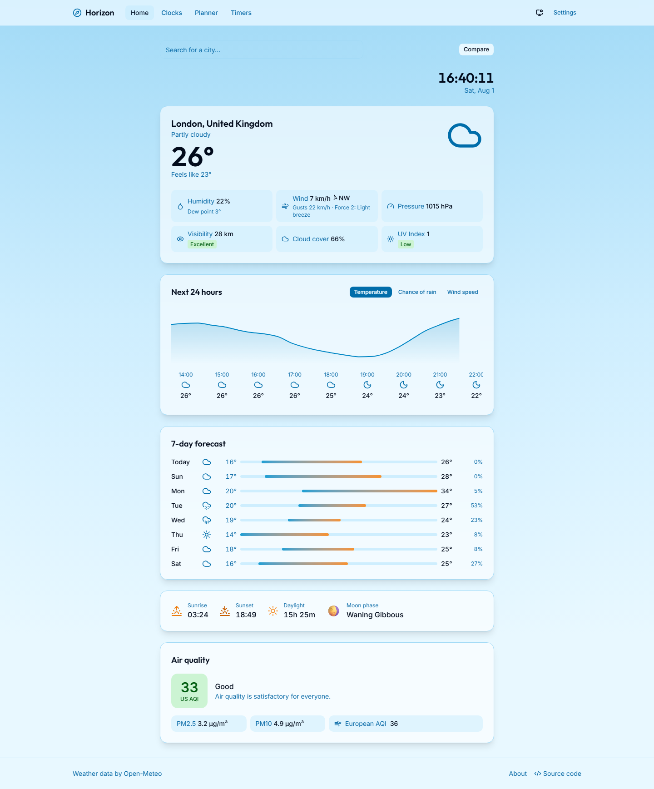
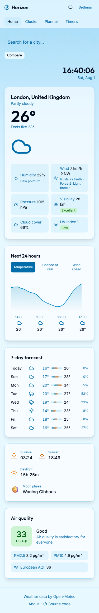
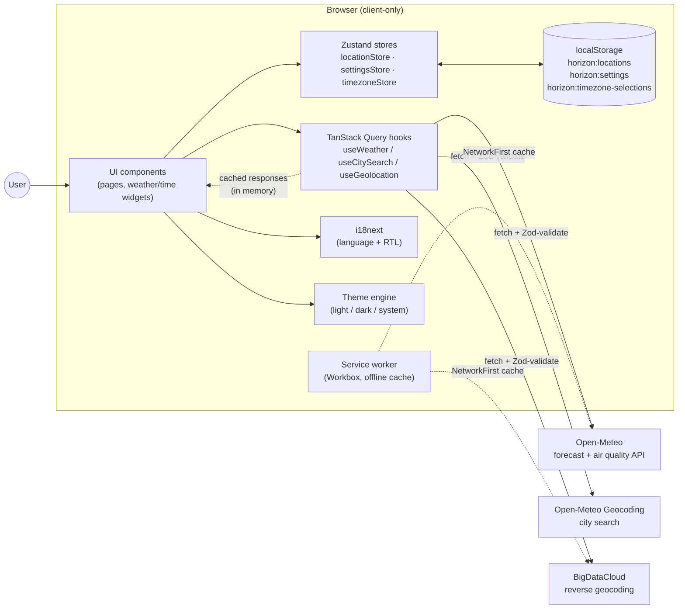
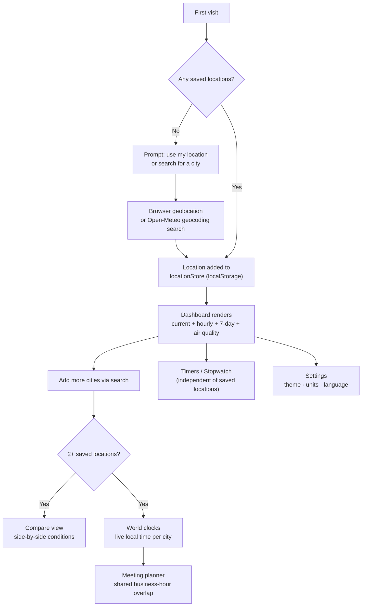

<div align="center">

# Horizon

**Weather and time, everywhere.**

A fast, installable, client-only weather + world-time PWA — no backend, no accounts, no tracking.

[](https://github.com/AhmedNassar7/horizon/actions/workflows/deploy.yml)
[](./LICENSE)
[](https://react.dev)
[](https://www.typescriptlang.org)

**[Live demo →](https://ahmednassar7.github.io/horizon/)**

</div>

---

## What it is

Horizon is a portfolio project built to look and behave like a production weather product (think MSN Weather / Google Weather), while staying 100% client-side: every request goes straight from the browser to a free, keyless public API, and every user preference lives in `localStorage`. There's no server to operate, no API key to leak, and nothing about you is logged anywhere.

It bundles two things that are usually separate apps — a weather dashboard and a world-time toolkit — because they share the same core problem: "what is it like, right now, somewhere else."

## Screenshots

| Desktop                                                                                                                                                                   | Mobile                                                                                                                               |
| ------------------------------------------------------------------------------------------------------------------------------------------------------------------------- | ------------------------------------------------------------------------------------------------------------------------------------ |
|  |  |

## Features

**Weather**

- Current conditions: temperature, "feels like," humidity + dew point, wind speed/direction/gusts on the international **Beaufort scale**, pressure, visibility (qualitative band), cloud cover, and **UV index** on real WHO/EPA exposure bands
- Hourly forecast with switchable temperature / precipitation-chance / wind-speed views
- 7-day forecast with min/max range bars and precipitation probability
- Sunrise, sunset, daylight duration, and moon phase
- Air quality: US AQI, PM2.5, PM10, and European AQI
- Severity-coded weather advisories
- Multi-location **compare** view and per-location detail pages
- City search (debounced, keyboard-accessible combobox) plus one-shot browser geolocation on first visit

**Time**

- World clock grid — add/remove any city, live-updating local time
- Time-difference calculator (hours ahead/behind you)
- Meeting planner — a shared-hour grid across every saved location, highlighting the overlap that falls in business hours (9am–5pm) everywhere
- Countdown timers (multiple, labeled) and a stopwatch with lap tracking

**Platform**

- Installable **PWA** with an offline-capable service worker (Workbox `NetworkFirst` caching for the weather/geocoding APIs), real maskable/adaptive icons, and a custom install prompt
- Full **i18n**: English, Spanish, French, Arabic (RTL), and Chinese, with per-route `<title>`/meta descriptions
- Light / dark / system theme
- Celsius/Fahrenheit, km-h/mph/knots, and 12h/24h unit preferences, all persisted locally
- Accessibility pass verified with `axe-core` (a real keyboard-trap bug in the city-search combobox was found and fixed this way — see `git log`)

## Tech stack

Versions below are pulled from `package.json` — see it for the authoritative list.

| Layer                        | Choices                                                                                                    |
| ---------------------------- | ---------------------------------------------------------------------------------------------------------- |
| Framework                    | React 19, React Router 7, Vite 8                                                                           |
| Language                     | TypeScript ~6                                                                                              |
| Styling / UI                 | Tailwind CSS 4, shadcn/ui (Radix primitives), `class-variance-authority`, `framer-motion`                  |
| State                        | Zustand 5 (with `persist` → `localStorage`)                                                                |
| Server-state / data fetching | TanStack Query 5                                                                                           |
| Validation                   | Zod 4 — every external API response is parsed at the boundary, never trusted as-typed                      |
| Charts                       | Recharts 3                                                                                                 |
| i18n                         | i18next / react-i18next, with `i18next-browser-languagedetector`                                           |
| PWA                          | `vite-plugin-pwa` (Workbox)                                                                                |
| Testing                      | Vitest + Testing Library (unit/component), Playwright + `@axe-core/playwright` (e2e + a11y), Lighthouse CI |
| Tooling                      | oxlint, Prettier, Husky + lint-staged                                                                      |

## Architecture & data flow

Everything runs in the browser. There is no application server: UI components read/write two independent client-side stores — TanStack Query's cache for anything that comes from an external API, and Zustand (persisted to `localStorage`) for user-owned state like saved locations and preferences.



**Design choices worth calling out:**

- **`weatherProvider` is an adapter interface**, not a direct call to Open-Meteo — UI/hooks depend only on the interface (`src/api/weatherProvider.ts`), so swapping or fronting the data source later doesn't touch component code.
- Every fetch response is **validated with Zod at the network boundary** (`src/api/httpClient.ts`) — an external API returning something unexpected fails loudly instead of silently corrupting UI state.
- User data (saved locations, unit preferences, theme, language) lives **only** in `localStorage`, namespaced under `horizon:*` keys — nothing is sent anywhere, which is also what `About.tsx` tells the user.

## User flow



## Local development

```bash
npm install
npm run dev          # start the Vite dev server
npm run build         # tsc -b && vite build (production build to dist/)
npm run preview       # serve the production build locally
```

### Testing

```bash
npm run test           # Vitest — unit + component tests
npm run test:watch     # Vitest in watch mode
npm run test:e2e       # Playwright — end-to-end suite (city search, weather display, time suite, theme toggle, PWA)
npm run test:e2e:ui    # Playwright with its UI runner
```

### Linting & formatting

```bash
npm run lint           # oxlint
npm run format         # prettier --write .
npm run format:check   # prettier --check .
npm run typecheck      # tsc -b --noEmit
```

Husky + lint-staged run oxlint and Prettier on staged files automatically on commit.

## Build & deployment

Horizon deploys to **GitHub Pages** from `.github/workflows/deploy.yml` on every push to `main`:

1. **`build`** — install, lint, typecheck, unit test, `vite build`, then upload the `dist/` folder as a Pages artifact.
2. **`e2e`** — runs the full Playwright suite against a real build; this gates the deploy.
3. **`lighthouse`** — runs `lhci autorun` against the built app; informational, does not block deploy.
4. **`deploy`** — runs only after `build` and `e2e` succeed, and publishes to GitHub Pages.

The app is served from a `/horizon/` base path (`vite.config.ts`), with a `404.html` → `index.html` redirect script (the standard `spa-github-pages` pattern) so deep links like `/horizon/clocks` survive a hard refresh under `BrowserRouter`.

Current Lighthouse CI numbers (informational job, not yet all green): **Accessibility 1.00**, **SEO 1.00**, **Best Practices 0.96**, **Performance 0.73**. Performance is bundle-size driven and is tracked as follow-up work, not something this README is going to round up.

## Project structure

```
src/
  api/            # fetch + Zod validation, provider adapters (Open-Meteo, geocoding)
  components/     # layout, search, time, weather, and shadcn/ui primitives
  hooks/          # useWeather, useCitySearch, useGeolocation, useTheme, ...
  i18n/           # i18next setup + locales/{en,es,fr,ar,zh}.json
  lib/            # pure helpers: units, timezone, beaufort scale, moon phase, ...
  pages/          # one file per route, each owns its own <title>/meta tags
  schemas/        # Zod schemas for every external API response
  store/          # Zustand stores (locations, settings, timezone selections)
e2e/              # Playwright specs
```

## License

[MIT](./LICENSE) © 2026 Ahmed Nassar
