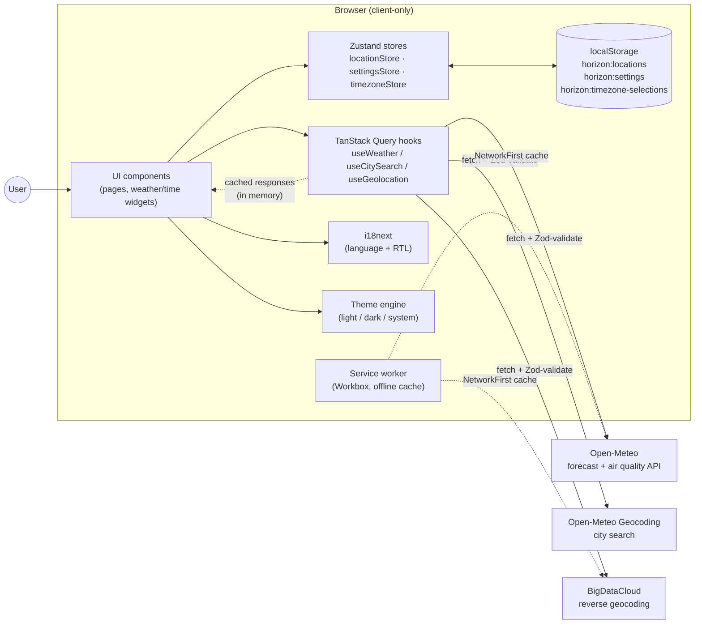

<div align="center">

# Horizon

**Weather and time, everywhere.**

A fast, installable, client-only weather + world-time PWA — no backend, no accounts, no tracking.

[](https://github.com/AhmedNassar7/horizon/actions/workflows/deploy.yml)
[](./LICENSE)

**[Live demo →](https://ahmednassar7.github.io/horizon/)**

</div>

---

## Screenshots

| Desktop                                                                                                                                                                   | Mobile                                                                                                                               |
| ------------------------------------------------------------------------------------------------------------------------------------------------------------------------- | ------------------------------------------------------------------------------------------------------------------------------------ |
|  |  |

## What it is

Horizon is a portfolio project built to look and behave like a production weather product (think MSN Weather / Google Weather), while staying 100% client-side — every request goes straight from the browser to a free, keyless public API, and every preference lives in `localStorage`. It bundles two things that are usually separate apps — a weather dashboard and a world-time toolkit — because they share the same core problem: _what is it like, right now, somewhere else._

## Architecture & data flow

Everything runs in the browser — there is no application server. UI components read/write two independent client-side stores: TanStack Query's cache for anything from an external API, and Zustand (persisted to `localStorage`) for user-owned state like saved locations and preferences.



**Worth calling out:** `weatherProvider` is an adapter interface (`src/api/weatherProvider.ts`), not a direct call to Open-Meteo, so swapping the data source later wouldn't touch component code. Every fetch response is validated with Zod at the network boundary (`src/api/httpClient.ts`) — an unexpected API shape fails loudly instead of silently corrupting UI state. User data lives only in `localStorage` under `horizon:*` keys; nothing is sent anywhere.

## Highlights

- **Weather** — current conditions, hourly + 7-day forecast, air quality, sunrise/sunset & moon phase, severity-coded advisories, multi-location compare
- **Time** — live world clocks, meeting planner (business-hour overlap across cities), time-difference calculator, timers & stopwatch
- **Platform** — installable offline-capable PWA, 5 languages including Arabic (RTL), light/dark/system theme, metric/imperial units

Full walkthrough → [User Guide](./docs/USER_GUIDE.md)

## Quick start

```bash
npm install
npm run dev
```

Full setup, testing, linting, and deploy details → [Developer Guide](./docs/DEVELOPER_GUIDE.md)

## Learn more

- 📖 [User Guide](./docs/USER_GUIDE.md) — how to use every feature
- 🛠️ [Developer Guide](./docs/DEVELOPER_GUIDE.md) — local setup, testing, build & deployment, project structure

## License

[MIT](./LICENSE) © 2026 Ahmed Nassar
