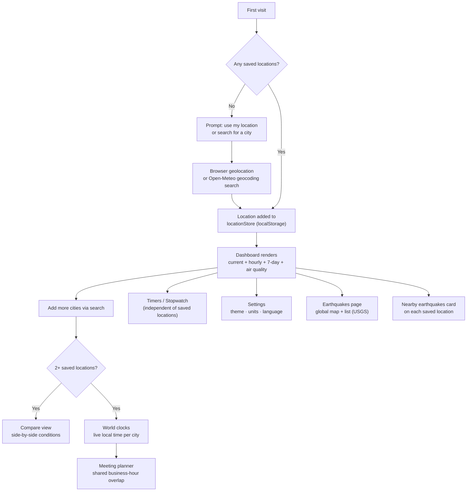

# User Guide

How the typical first visit and everyday use of Horizon flows, end to end.

## Getting started

On your first visit, Horizon asks for your location. Allow it, and your local weather loads immediately. If you'd rather not share your location, search for any city by name instead — the search box is available from the header on every page.

## Reading the dashboard

Selecting a location shows:

- **Current conditions** — temperature, "feels like," humidity and dew point, wind speed/direction/gusts (with a Beaufort force description), pressure, visibility, cloud cover, and UV index.
- **Hourly forecast** — switch between temperature, precipitation chance, and wind speed views for the next 24 hours.
- **7-day forecast** — daily highs/lows and precipitation probability.
- **Sunrise, sunset, daylight length, and moon phase.**
- **Air quality** — US AQI, PM2.5, PM10, and European AQI, with a plain-language health note.
- **Advisories** — severity-coded weather warnings when conditions call for one.

## Managing locations

Search adds a new location and makes it active. Add a second (or more) to unlock:

- **Compare** — every saved location's current conditions side by side.
- **World clocks** — a live-updating clock per saved location.
- **Meeting planner** — a shared 24-hour grid across all your saved locations, highlighting the hours that fall in everyone's business hours (9am–5pm).
- **Time difference** — pick any two cities and see how far apart they are, right now.

## Earthquakes

Two ways to see recent seismic activity, both sourced live from the **USGS** (U.S. Geological Survey):

- **Earthquakes page** (nav bar) — a world map of recent events, color-coded by magnitude, with a matching list. Filter by **minimum magnitude** and **time window**.
- **Nearby earthquakes card** — on every saved location's dashboard, shows the closest recent events with distance and time since each one.

Each event links to its official USGS report. A **safety checklist** (drop, cover, hold on) is included for reference.

**Important:** this is reporting, not prediction. Events appear only after USGS confirms them — typically minutes after the fact. There is no early-warning or "detected near you" alert.

## Timers & stopwatch

Independent of any saved location: set multiple labeled countdown timers, or use the stopwatch with lap tracking.

## Settings

Change temperature units (°C/°F), wind speed units (km/h, mph, or knots), 12h/24h clock format, theme (light/dark/system), and language (English, Spanish, French, Arabic, Chinese) — every choice is saved locally and remembered on your next visit.

## Installing as an app

Horizon is an installable PWA. Most browsers will offer an install prompt after a short visit; installing gives you an app-like icon and window, and the dashboard keeps showing your last-known data even if you open it offline.

## Your data stays on your device

Nothing you search, save, or set is sent anywhere — it's stored only in your browser's local storage. There's no account and no server that could leak it. The site does use Google Analytics for anonymous traffic insights, unrelated to anything you save.

← [Back to README](../README.md) · [Developer Guide](./DEVELOPER_GUIDE.md)
